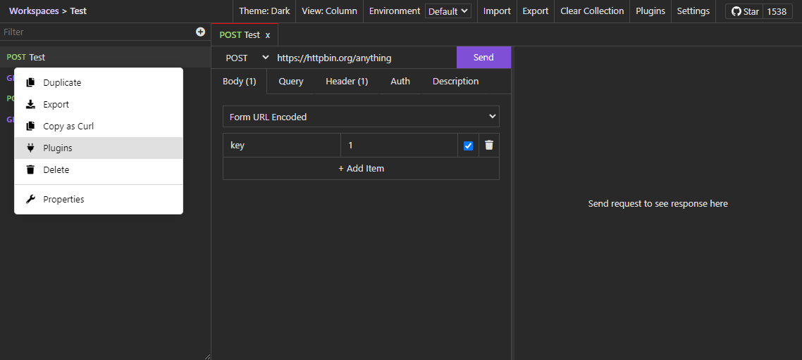
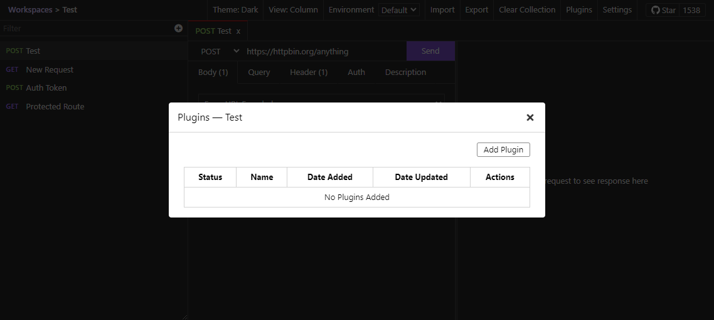
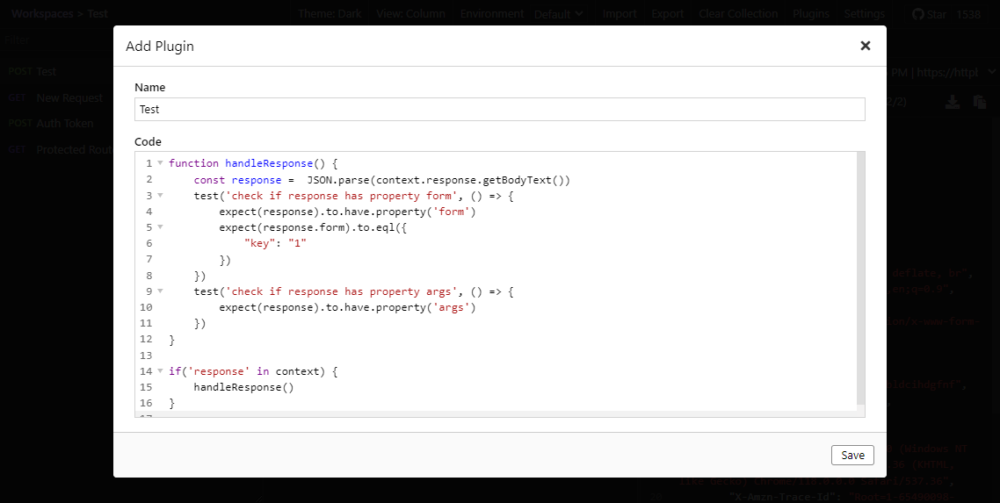
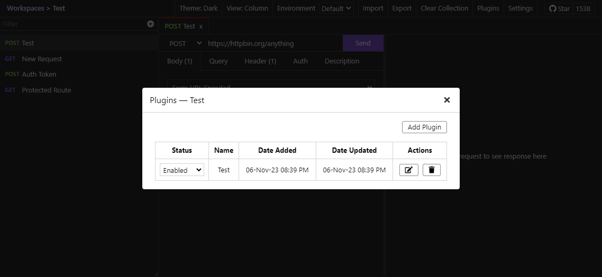
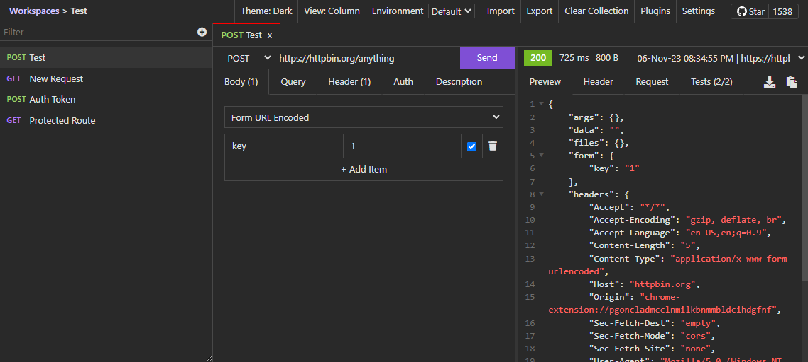
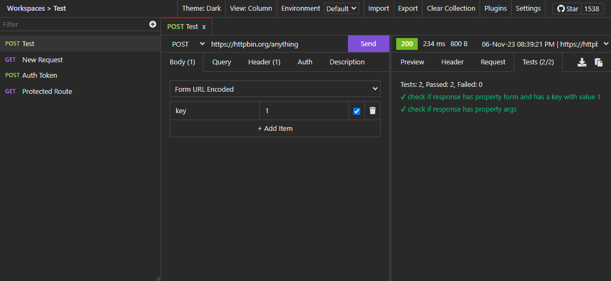

# Testing Response Data

Restfox supports writing automation test scripts in JavaScript for your API requests to assert its behaviour.

**Here's an example test plugin :**
```javascript
function handleResponse() {
    const response =  JSON.parse(context.response.getBodyText())
    test('check if response has property form and has a key with value 1', () => {
        expect(response).to.have.property('form')
        expect(response.form).to.eql({
            "key": "1"
        })
    })
    test('check if response has property args', () => {
        expect(response).to.have.property('args')
    })
}

if('response' in context) {
    handleResponse()
}
```

**Here are the steps :**

1) Right click on a request to access Plugins

{data-zoomable}

2) Click on add plugin to create a new plugin

{data-zoomable}

3) Write a test script and save it

{data-zoomable}

{data-zoomable}

4) Send the request & test results will be available in the Tests tab of the response panel

{data-zoomable}

{data-zoomable}
